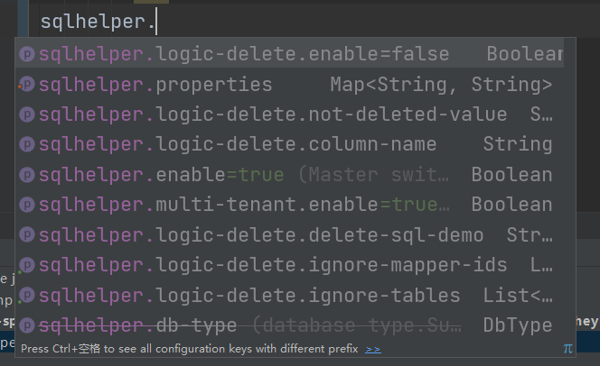

# MyBatis SqlHelper Spring Boot

[MyBatis SqlHelper](https://github.com/heykb/mybatis-sqlhelper)的spring boot集成版本，自动配置插件、从容器中自动扫描注入信息添加到插件。

~~~xml
<dependency>
    <groupId>io.github.heykb</groupId>
    <artifactId>mybatis-sqlhelper-spring-boot-starter</artifactId>
    <version>3.0.0.SR1</version>
</dependency>
~~~

## IDEA提示

## 将创建的注入信息类生成bean注入到容器即可生效。
~~~java
@Component
public class InjectUpdateByHandler implements InjectColumnInfoHandler {
    @Override
    public String getColumnName() {
        return "updated_by";
    }

    @Override
    public String getValue() {
        return "'zrc'";
    }

    @Override
    public int getInjectTypes() {
        return INSERT|UPDATE;
    }
  
    @Override
    public boolean checkTableName(String tableName) {
        return tableName.equals("people") || tableName.equals("dept_data_test");
    }
}
~~~

与直接使用[MyBatis SqlHelper](https://github.com/heykb/mybatis-sqlhelper)与[MyBatis SqlHelper Spring](https://github.com/heykb/mybatis-sqlhelper-spring)不同，逻辑删除的功能默认是关闭的。你可通过application.properties配置逻辑删除的信息。自定义LogicDeleteInfoHanlder的bean后，环境变量配置失效。

## 未完待续。。(如果你有兴趣，右上角watch该项目获得最新的动态)
 
## 参与贡献

如果你发现问题，提交issue。

如果你解决了问题，fork项目提交pull request。

## 联系我
QQ: 1259609102 
email: bigsheller08@gmail.com,1259609102@qq.com